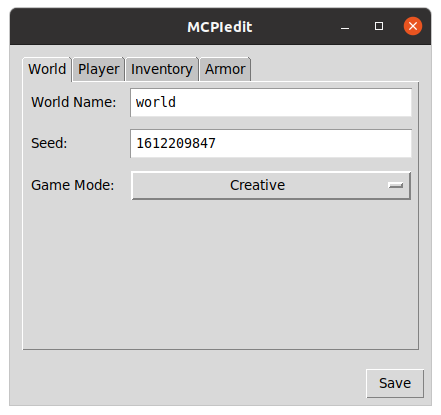

# MCPIedit



A Simple Tool For Modifying MCPI Level Files

## How To Install/Update
```sh
sudo apt-get install build-essential
rm -rf ~/.mcpiedit
git clone https://github.com/MCPI-Revival/MCPIedit.git ~/.mcpiedit
pip install pinbt
```

## How To Run
```sh
~/.mcpiedit/mcpiedit
```
